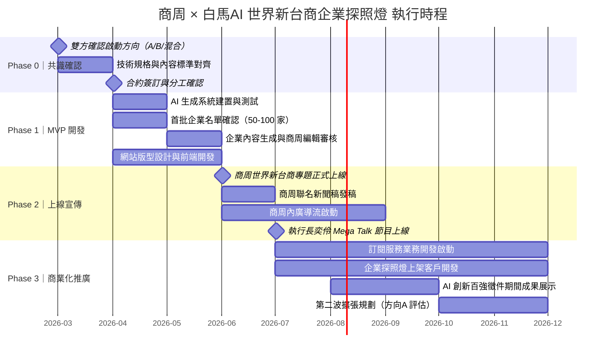

# 商周 × 白馬AI｜世界新台商企業探照燈 共創計劃執行提案書

> **摘要：** 商業周刊迎來第2000期里程碑之際，與白馬AI 共同發起「世界新台商企業探照燈」計劃——以 AI 內容生成技術，為台灣企業打造專屬的數位履歷與品牌故事，在商周域名下集結成一座動態的「台商企業知識庫」。本計劃透過 freemium 模式創造可持續的訂閱收入，對商周帶來新業務模式，對白馬AI 提供旗艦級示範案例，對台灣企業則提供在 AI 搜尋時代不可或缺的品牌能見度。

---

## 目錄

1. [時代背景與專案起點](#1-時代背景與專案起點)
2. [專案概覽：世界新台商企業探照燈](#2-專案概覽世界新台商企業探照燈)
3. [商業模式：Freemium 多層次收入架構](#3-商業模式freemium-多層次收入架構)
4. [執行計劃](#4-執行計劃)
5. [對雙方的策略價值](#5-對雙方的策略價值)
6. [宣傳計劃與媒體效益](#6-宣傳計劃與媒體效益)
7. [風險評估與因應策略](#7-風險評估與因應策略)
8. [下一步行動建議](#8-下一步行動建議)
9. [附錄](#附錄)

---

## 1. 時代背景與專案起點

### 1.1 商周 2000 期：一個台灣媒體的里程碑

2026年3月12日，商業周刊正式邁入第2000期。這不只是一個數字，而是一部橫跨三十餘年、記錄台灣產業起伏的活歷史——從台灣製造業的全球崛起，到科技業的國際化布局，到如今數位與 AI 浪潮重塑商業格局，商周始終是台灣企業最重要的觀察者與說書人。

第2000期不只是回顧，更是一個啟動新時代內容服務的天然錨點。「世界新台商企業探照燈」計劃，正是商周以這個歷史節點為起點，向台灣產業生態發出的全新邀請：**讓更多台灣企業的故事，被更多人看見。**

### 1.2 世界新台商：日不落台灣的時代命題

台商的角色正在轉型。過去的台商以「製造」聞名於世，如今的台灣企業以「技術」、「設計」、「品牌」在全球供應鏈中佔據不可替代的地位——從半導體到精密機械，從文創到生技，台灣企業遍布世界各地，形成一張低調卻堅韌的「日不落網絡」。

然而，大多數台灣企業——尤其是中小型的優質企業——在數位世界中幾乎是隱形的。官網陳舊、搜尋排名低落、英語內容缺乏，使得這些企業在 AI 時代的品牌能見度遠遠落後於其實際的產業地位。

> **這正是「世界新台商企業探照燈」要解決的問題：用 AI 的速度，商周的深度，讓台灣企業的故事在全球被找到。**

### 1.3 AI 搜尋時代，媒體域名的 SEO/AEO 權重優勢

搜尋引擎的規則正在被 AI 重寫。傳統的 SEO（搜尋引擎最佳化）時代，企業靠關鍵字與反向連結爭搶排名；如今進入 AEO（Answer Engine Optimization，答案引擎最佳化）時代，Google AI Overview、ChatGPT Search、Perplexity 等 AI 問答系統在回答使用者問題時，高度仰賴**可信度高、內容結構清晰的權威媒體域名**作為資料來源。

這代表一件事：**在商周域名下的企業內容，天然擁有其他任何平台難以複製的搜尋權重。**

| 能見度來源 | 企業自架網站 | 一般行銷平台 | 商周域名內容 |
|-----------|------------|------------|------------|
| Google 搜尋排名 | 低（新站權重低）| 中 | 高（成熟媒體域名） |
| AI 問答引用機率 | 低 | 低至中 | 高（商周為公認權威來源）|
| 內容可信度背書 | 自說自話 | 廣告性質明顯 | 媒體報導公信力 |
| 中英雙語觸及 | 需另外建置 | 有限 | 本計劃內建 |

對台灣企業而言，花費資源建置自有網站的 SEO，遠不如**在商周這個已有三十年積累的媒體域名下，擁有一份結構化的企業履歷**。這正是本計劃訂閱服務的核心差異化價值，也是企業付費的根本動機。

---

## 2. 專案概覽：世界新台商企業探照燈

### 2.1 核心構想

「世界新台商企業探照燈」是一個 AI 驅動的企業內容生成與展示平台，部署於商周域名之下。其核心構想是：**以 AI 的生成效率，結合商周三十年的媒體公信力，為台灣企業打造兼具深度與廣度的數位品牌資產。**

每一家入選企業，將在商周網站上擁有一份結構化的「企業履歷頁面」，內容由 AI 整合企業官網、新聞稿、上市櫃公開資料、商周歷年報導等多元來源自動生成，並由商周編輯團隊把關審核。頁面以中英雙語呈現，並具備符合 SEO/AEO 標準的內容結構，確保在各大搜尋引擎與 AI 問答系統中獲得最佳曝光。

企業頁面並非孤立存在——平台同步建構**產業關聯圖譜**，自動標示企業間的策略合作、供應鏈關係、產業生態連結，為讀者提供動態解讀台灣產業版圖的視角，也為商周自身積累獨特的企業知識資產。

### 2.2 兩個啟動方向：並陳比較

計劃目前有兩個可行的啟動方向，各有其戰略優勢與執行考量，以下客觀呈現供雙方討論決策：

| 比較維度 | **方向 A：世界新台商2000大** | **方向 B：企業探照燈（新興企業優先）** |
|---------|---------------------------|--------------------------------------|
| **企業範疇** | 上市上櫃企業為主，規模大、品牌知名度高 | 非上市中小型新興企業為主 |
| **市場定位** | 台灣產業旗艦級指標，標竿效應強 | 類似商周既有「企業探照燈」服務，聚焦發掘新興力量 |
| **內容難度** | 公開資料豐富，但解讀複雜、法律敏感度較高 | 資料相對有限，AI 生成的附加價值更明顯 |
| **付費意願** | 品牌知名，但付費訂閱動機待驗證 | 企業資訊能見度需求強烈，付費轉換率預期較高 |
| **更新頻率** | 法說、季報、重大訊息頻繁 | 每季更新即可，運營負擔較低 |
| **MVP 友善度** | 規模宏大，啟動複雜度高 | 範疇聚焦，適合快速驗證商業模式 |
| **長期擴張性** | 本身即為最終規模目標 | 可作為第一階段，成熟後再擴展至上市公司 |
| **合規風險** | 上市公司內容需謹慎，避免影響股價敏感資訊 | 非上市公司爭議較少，彈性較高 |

> 兩個方向並非互斥，亦可考慮**混合路徑**：以方向B 作為 MVP 啟動，快速驗證商業模式後，再以方向A 的規模與品牌效應進行第二波擴張。

### 2.3 網站內容三大模組

無論採取哪個方向，內容平台均由以下三個核心模組構成：

#### 模組一｜企業履歷頁面（AI 企業黃頁）

企業的「數位名片 × 媒體認證履歷」，整合多元資料來源自動生成，內容包含：

- 企業基本資訊（成立沿革、主要業務、規模指標）
- 近期重要動態（新聞稿、重大合作、獲獎紀錄）
- 產品與服務概要
- 品牌故事與創辦人理念
- 中英雙語版本

**資料來源：** 企業官網、公開新聞稿、上市上櫃資料、商周歷年報導採訪稿

#### 模組二｜產業關聯圖 / 台商關係網

平台最具差異化的核心功能，以視覺化方式呈現企業間的關聯脈絡：

- 供應鏈上下游關係標示
- 策略聯盟 / 合資合作連結
- 同產業群聚地圖
- 動態互動式探索（類似偵查辦案的線索連結圖）

此模組為商周積累獨一無二的**產業知識資產**，構築長期競爭護城河。

#### 模組三｜日不落台灣（中英雙語同步）

每份企業履歷均提供中英雙語版本，面向：

- 海外台商社群
- 國際採購商 / 投資人
- 外媒及國際 AI 搜尋引擎引用

英文版本不只是翻譯，而是依據國際讀者習慣重新組織內容架構，確保在英語 AEO 環境中同樣具備搜尋優勢。

---

## 3. 商業模式：Freemium 多層次收入架構

### 3.1 核心邏輯

本計劃採取**「免費內容引流、訂閱服務取價」**的 freemium 策略。

第一批免費上架的企業內容，扮演平台的展示窗口：對讀者而言，這是台灣產業的免費知識庫；對企業而言，這是「你的競爭同業已經上架，你還沒有」的轉換誘因；對商周與白馬AI 而言，這是累積流量、建立公信、孵化後續付費服務的資產。

**商周域名的 SEO/AEO 權重**是整個商業模式的核心差異化槓桿：企業付費，買的不只是內容生成服務，而是「在商周這個 AI 搜尋時代最被信任的媒體域名下，持續被找到的能力」。

### 3.2 四層收入模型

#### 層一｜內容自動更新訂閱（商周 × 白馬AI 分潤）

- **對象：** 已免費上架的企業，升級為動態更新版本
- **服務內容：** 企業動態、新聞稿、產品更新自動同步至企業履歷頁面
- **定價：** **3,000 元 / 月**
- **核心訴求：** 商周域名的 SEO/AEO 加持 + 企業資訊即時更新，確保搜尋引擎始終呈現最新版本
- **備注：** 若企業選擇不訂閱，頁面維持一次性生成版本（2026年6月版本），不再更新

#### 層二｜企業探照燈首次上架（商周 × 白馬AI 分潤）

- **對象：** 未納入第一波免費上架的企業，主動申請上架
- **服務內容：** AI 生成完整企業履歷頁面，上架至商周域名
- **定價：** **首次生成 150,000 元**（一次性）+ 年度訂閱更新 **36,000 元 / 年**（月均 3,000 元）
- **核心訴求：** 取得商周的媒體背書與 SEO/AEO 平台優勢，進入台商企業知識庫

#### 層三｜深度報導 × 延伸行銷（商周主導）

- **對象：** 希望在企業履歷基礎上進一步強化品牌的企業
- **服務內容（可選組合）：**
  - 商周記者深入採訪 + 數位長文報導
  - 紙本雜誌專題出現
  - CEO 人設打造 / 企業形象攝影
  - 短影音、訪談長影音製作（參考宣揚等平台模式）
- **收入歸屬：** 商周為主要收益方

#### 層四｜AI 企業數位發言人服務（白馬AI 主導）

- **對象：** 希望建立全天候數位客服與品牌溝通能力的企業
- **服務內容：** 以企業知識庫為基礎，建立多國語言 AI 發言人，能自動回應網路洽詢、介紹企業產品、支援業務開發前端
- **延伸方向：** 其他可與白馬AI 團隊共同設計的客製化 AI 企業服務
- **收入歸屬：** 白馬AI 為主要收益方

### 3.3 收入歸屬架構

| 服務層次 | 收入性質 | 主要收益方 |
|---------|---------|-----------|
| 層一：內容自動更新訂閱 | 訂閱制，持續性 | 商周 × 白馬AI 分潤 |
| 層二：企業探照燈上架 | 一次性 + 年訂閱 | 商周 × 白馬AI 分潤 |
| 層三：深度報導延伸行銷 | 專案制，一次性 | 商周 |
| 層四：AI 數位發言人服務 | 訂閱 / 專案制 | 白馬AI |

> 各層分潤比例依雙方合約另行約定。

### 3.4 年度財務預估（情境模型）

以下試算基於以下假設：
- 第一批免費上架企業數：100 家（MVP 規模）
- 訂閱服務啟動月份：2026年Q3
- 財務預估範圍：**2026 年度**（上線後約 6 個月運營）

#### 層一：內容自動更新訂閱

| 情境 | 免費企業轉訂閱率 | 訂閱企業數 | 月費 | 年度收入（6個月）|
|------|---------------|-----------|-----|----------------|
| 保守 | 10% | 10 家 | 3,000 | **18 萬元** |
| 基準 | 25% | 25 家 | 3,000 | **45 萬元** |
| 樂觀 | 40% | 40 家 | 3,000 | **72 萬元** |

#### 層二：企業探照燈首次上架

| 情境 | 新上架企業數 | 首次生成費 | 年度收入 |
|------|-----------|----------|---------|
| 保守 | 3 家 | 150,000 | **45 萬元** |
| 基準 | 8 家 | 150,000 | **120 萬元** |
| 樂觀 | 15 家 | 150,000 | **225 萬元** |

#### 年度總收入預估（層一 + 層二合計，2026年）

| 情境 | 年度收入合計 |
|------|------------|
| **保守** | **約 63 萬元** |
| **基準** | **約 165 萬元** |
| **樂觀** | **約 297 萬元** |

> 層三（深度報導）與層四（AI 發言人）因高度客製化，收入視個案洽談，未納入上表試算，實際總收入將高於此預估。

> **第二年展望：** 若 MVP 驗證成功後啟動方向A 擴展（上市上櫃規模），並以每年新增 200 家計，規模效應將顯著提升各層收入天花板。

---

## 4. 執行計劃

### 4.1 專案時程

### 4.2 分工架構

| 工作項目 | 商周負責 | 白馬AI 負責 |
|---------|---------|-----------|
| **內容品質** | 編輯審核、事實查核、法律合規確認 | AI 生成系統開發、內容自動更新機制 |
| **平台技術** | 提供網站域名與發布環境 | 網站前後端開發、SEO/AEO 技術優化 |
| **企業資料** | 商周歷年報導採訪稿授權使用 | 外部資料爬取與整合（官網、新聞稿等）|
| **業務開發** | 企業客戶招募、深度服務銷售 | AI 發言人服務推廣 |
| **品牌宣傳** | 商周媒體資源、雜誌、社群、活動 | 白馬AI 技術能力展示與背書 |
| **客服運營** | 企業關係維護 | 技術支援、系統維運 |

### 4.3 商周端人力需求盤點

為確保專案順利推進，建議商周評估以下人力資源配置：

| 角色 | 職責 | 預估投入 |
|------|------|---------|
| 專案負責人 | 跨部門協調、對接白馬AI、追蹤里程碑 | 50%（兼任）|
| 編輯審核人員 | 企業內容品質把關（每家企業約 30-60 分鐘）| 1-2 人，依上架速度調配 |
| 業務開發人員 | 企業客戶開發、訂閱服務推廣 | 1 人（兼任或新增）|
| 法務諮詢 | 上市公司內容合規確認（視方向A/B 決定需求強度）| 視需求 |

### 4.4 關鍵里程碑與決策點

| 時間 | 里程碑 | 決策點 |
|------|-------|-------|
| 2026-04 | 合約簽訂，Phase 1 正式啟動 | 方向A / B / 混合確認 |
| 2026-06 | 首批內容生成完畢，等待上線 | 內容品質 Go/No-Go 評審 |
| 2026-06 | 平台正式上線 | 宣傳時程確認 |
| 2026-08 | 上線後 2 個月，訂閱轉換初步數據 | 評估是否加速商業化推廣 |
| 2026-10 | Phase 3 中期檢討 | 評估方向A 擴張時程 |
| 2026-12 | 年度成果回顧 | 2027 年規模目標設定 |

---

## 5. 對雙方的策略價值

### 5.1 對商周的六大價值

**① AI 應用示範，走在媒體產業前沿**
與專業 AI 團隊合作，以具體可見的作品，展現 AI 對媒體產業的加值潛力，建立商周在「AI 時代媒體轉型」議題上的領導地位。

**② 創造新收入模式，讓 AI 直接連結業務**
跳脫「AI 等於降本增效」的框架，將 AI 能力直接轉化為可訂閱、可收費的新服務，為商周開創媒體訂閱以外的新業務線。

**③ 由外圍帶動內部 AI 轉型**
以業務合作專案的形式切入，不需要通過集團 IT 採購管控，不直接挑戰編輯核心工作，以「鄉村包圍城市」的方式自然帶動內部 AI 應用文化的形成。

**④ 共創共擔，降低啟動門檻**
與白馬AI 共同承擔開發成本，商周不需獨自承擔高額技術啟動費用，專案落地難度大幅降低。

**⑤ 善用商周的平台優勢，創造競爭護城河**
商周的品牌公信力、三十年媒體域名 SEO 積累、讀者社群，都是其他 AI 服務無法複製的資產。本計劃將這些資產轉化為可持續的商業優勢，越早啟動、護城河越深。

**⑥ 自有 AI 成果，強化品牌領導地位**
商周自身擁有一件拿得出手的 AI 作品，不僅是對外的品牌聲量，更是向廣告主、合作夥伴、讀者展示「商周不只是寫 AI，商周自己在做 AI」的有力證明。

### 5.2 對白馬AI 的四大價值

**① 商周作為旗艦級示範案例**
以台灣最具影響力的財經媒體作為旗艦示範案例（showcase），向市場證明白馬AI 對 AI 內容產業的深刻理解與執行力，有效突破市場對 AI 服務的不確定疑慮。

**② 商周媒體資源作為品牌放大器**
商周講自己的 AI 轉型故事，同時也在為白馬AI 定調、發聲。估計媒體整合效益超過 500 萬元的宣傳資源，等同於白馬AI 獲得一個大規模的免費品牌曝光機會。

**③ 透過商周生態圈，觸及潛在企業客戶**
每一家因為商周的報導或平台而對企業探照燈服務感興趣的企業，都是白馬AI 的潛在客戶來源，形成持續的業務漏斗。

**④ 可運營、可訂閱的商業模式作品**
與商周的共創成果，不只是技術展示，而是一個實際上線、實際收費、實際運營的產品，兼具行銷展示與新商業模式建立的雙重價值。

---

## 6. 宣傳計劃與媒體效益

### 6.1 宣傳里程碑

| 時間 | 宣傳動作 | 說明 |
|------|---------|------|
| 2026 Q2/Q3 | 商周世界新台商專題上線 | 平台正式對外發布，聯名新聞稿發稿 |
| 2026 Q3 | 執行長奕伶 Mega Talk 節目訪問上線 | 以商周自身 AI 成果作為訪談核心，展示實際作品 |
| 2026 Q3 | 2026 AI 創新百強徵件期間 | 作為商周自身 AI 策略成果，於徵件活動中公開展示（視作品品質與影響力 TBC）|
| 持續 | 商周內廣導流 | 網站 footer 商周 × 白馬AI 聯名，讀者自然導流 |

### 6.2 商周宣傳資源盤點

- **數位流量：** 商周網站擁有龐大的忠實讀者基礎，企業履歷頁面可直接受惠於既有流量
- **社群媒體：** 商周 Facebook、Instagram、LINE 官方帳號推播
- **電子報：** 商周訂閱者電子報曝光
- **雜誌紙本：** 視合作深度，提供相關版面介紹
- **活動資源：** 商周年度論壇、業務活動可作為展示平台

### 6.3 預估媒體效益

本計劃預估能帶來超過 **500 萬元**的媒體整合行銷專案效益（以市場整合行銷專案報價計算，而非版面定價）。

| 效益來源 | 說明 |
|---------|------|
| 商周媒體曝光（數位+平面）| 以商周廣告版位市場定價換算 |
| 活動與論壇出席 | 主題演講、展位、議程曝光等 |
| 執行長節目訪問 | Mega Talk 節目觀看數及後續媒體引用 |
| AI 創新百強展示 | 業界活動曝光與報導 |
| 口碑與媒體引用 | 其他媒體報導商周 AI 轉型故事的二次擴散效益 |

---

## 7. 風險評估與因應策略

| 風險項目 | 風險描述 | 因應策略 |
|---------|---------|---------|
| **企業付費意願不確定** | 免費內容上架後，企業不願轉換為付費訂閱 | Freemium 本身即為低門檻設計；強調商周 SEO/AEO 的差異化價值；初期設定優惠期定價刺激轉換 |
| **AI 內容品質爭議** | AI 生成內容出現事實錯誤或企業形象問題 | 商周編輯審核作為品質閘門；建立企業申請更正的快速回應機制；內容明確標示「資料更新日期」|
| **資料來源合規** | 使用企業資訊是否涉及版權或隱私問題 | 建立資料來源白名單（官網、公開新聞稿、上市公開資訊）；商周歷年報導需確認授權範疇 |
| **上市公司內容敏感性** | 方向A 場景下，上市公司履歷內容可能影響市場解讀 | 優先推進方向B（非上市企業）作為 MVP，方向A 啟動前加強法務審查流程 |
| **白馬AI 技術交付風險** | AI 系統開發未能在預定時程內達到品質標準 | 設定明確的技術驗收標準與里程碑；Phase 1 預留緩衝期；商周保有最終內容審核權 |
| **商周內部資源不足** | 編輯審核人力不足以支撐內容生成速度 | Phase 1 控制首批企業數量（50-100 家）；建立標準化審核流程降低每家企業審核時間 |

---

## 8. 下一步行動建議

本計劃的共識確認後，建議依序推進以下行動：

### Step 1｜確認啟動方向
雙方共同決定採取方向A、方向B 或混合路徑，並確認第一批企業名單的選取原則與規模。

### Step 2｜商周內部資源盤點
商周確認以下項目的人力與資源可行性：
- [ ] 專案負責人指定
- [ ] 編輯審核人力評估（每家企業預估工時）
- [ ] 域名與網站技術環境確認（是否由白馬AI 建置或整合至現有商周網站）
- [ ] 法務確認資料使用範疇

### Step 3｜合約框架討論
雙方法務確認以下核心條款框架：
- [ ] 各層服務的分潤比例
- [ ] 商周歷年報導的授權範疇與使用方式
- [ ] 作品著作權歸屬
- [ ] 合作期間與退出機制

### Step 4｜召開第一次工作會議

**建議議程：**
1. 啟動方向最終確認（15 分鐘）
2. 技術架構簡報（白馬AI，20 分鐘）
3. 商周資源與限制說明（20 分鐘）
4. 首批企業名單討論（15 分鐘）
5. 時程與下次會議確認（10 分鐘）

---

## 附錄

### 名詞解釋

| 術語 | 說明 |
|------|------|
| **SEO**（Search Engine Optimization） | 搜尋引擎最佳化。透過內容結構、關鍵字、外部連結等方式，提升網頁在 Google 等搜尋引擎中的自然排名 |
| **AEO**（Answer Engine Optimization） | 答案引擎最佳化。針對 AI 驅動的搜尋（如 Google AI Overview、ChatGPT Search、Perplexity）進行內容優化，提高被 AI 引用為答案來源的機率 |
| **Freemium** | 免費增值模式。基礎服務免費提供，進階功能或持續服務需付費，以免費內容吸引流量、轉換付費用戶 |
| **MVP**（Minimum Viable Product） | 最小可行產品。以最低資源投入，建立足以驗證商業假設的產品版本 |
| **T368** | 商周既有的企業服務形式，以此作為本計劃的參考基準 |
| **企業探照燈** | 商周既有服務項目，提供企業在商周平台上介紹自身品牌與故事的機會 |

### 參考案例

**商周既有服務：企業探照燈**
商周已有協助中小企業在商周平台上進行品牌故事介紹的服務經驗，本計劃在此基礎上以 AI 大幅提升內容生成效率與服務規模。

**T368 網站工作模式**
本計劃的內容生成與呈現方式，參考以新光三越 T368 網站為代表的自動化內容平台運作模式，結合 AI 技術與人工審核，實現高效率、高品質的企業內容產製。

---

*本提案書由商周 × 白馬AI 共同發起，2026年3月。*
*聯名對外展示版本，如需進一步洽談請聯繫雙方窗口。*
